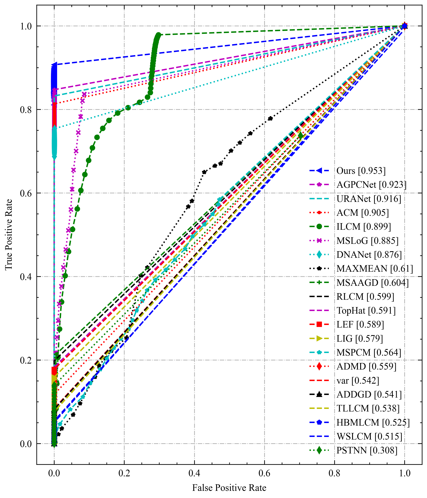

# IRSTD-Benchmark

这个仓库是一个弱小目标检测Benchmark工具，旨在提供一个集成了典型弱小目标检测算法和统一评价指标的平台。该工具可以帮助研究人员和开发者评估不同算法在弱小目标检测任务上的性能。

## 特性
- 提供了标准的弱小目标检测评价指标，用于客观评估算法性能，包括但不限于：
  - 精确度-召回（Precision-Recall）
  - F1值
- 简单易用的接口和示例代码，方便用户快速上手并集成自己的算法或进行评估实验。

| IRSTD1K  | MDFA                        |
|------------------------------|-----------------------------|
|  |  |

| Merged                        | SirstAUG                        |
|-------------------------------|---------------------------------|
|  |  |


## 数据集

| 数据集      | 链接 |
| ----------- | ----------- |
| Sirst AUG      | [Link](https://github.com/Tianfang-Zhang/AGPCNet)       |
| MDFA   | [Link](https://github.com/wanghuanphd/MDvsFA_cGAN)        |
| IRSTD1K   | [Link](https://github.com/RuiZhang97/ISNet)        |


以上数据集已经整理好上传至Google Drive，用户可以直接下载使用。

## 安装和使用

## 安装[Matlab Python API](https://ww2.mathworks.cn/help/matlab/matlab_external/install-the-matlab-engine-for-python.html)
```bash
pip insstall -r requirements.txt
```

## 使用
```bash
python method.py --dataset mdfa > mdfa.txt
                            irstd > istd1k.txt
                            sirstaug > sirstaug.txt
                            merged > merged.txt 
```
### 绘制ROC曲线

```bash 
python plot_curve.py
```


## 贡献

欢迎对该仓库做出贡献！如果您有新的算法实现、改进或其他功能增强的建议，请提交Pull Request。我们乐于接受新的贡献并持续改进该工具。

## 许可证

本工具使用 [MIT许可证](LICENSE)。

请在使用本工具时遵守许可证规定。
