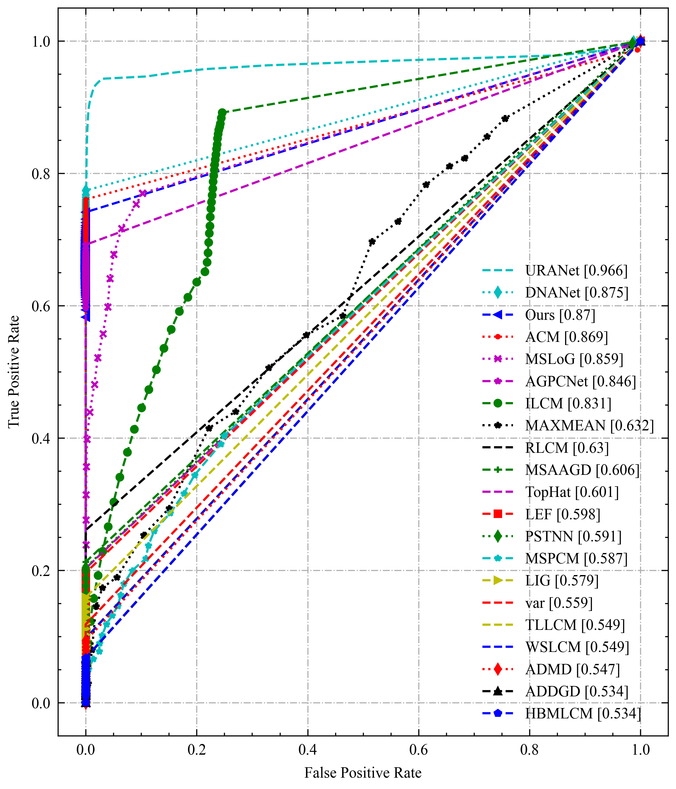
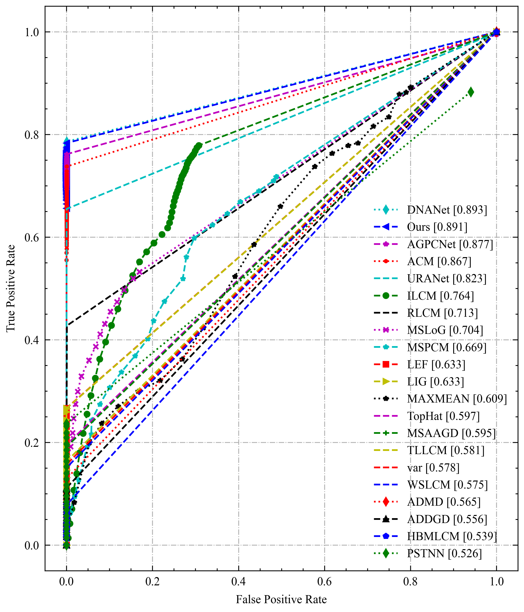
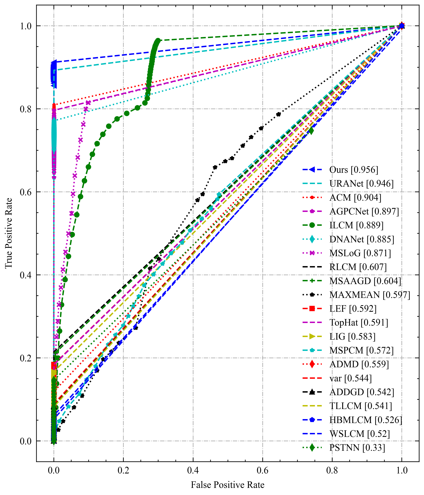
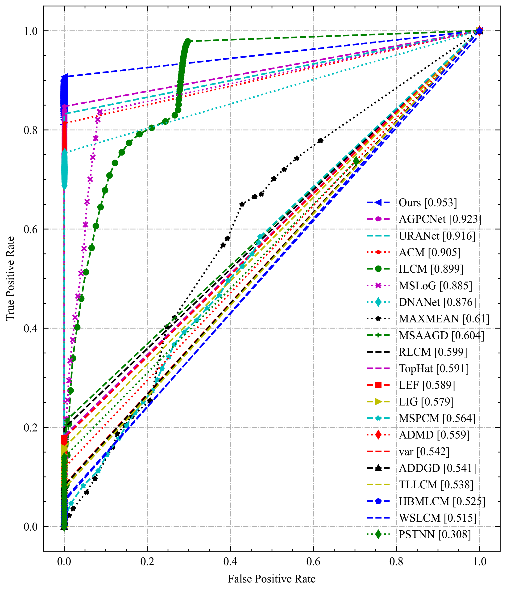

# IRSTD-Benchmark


## Paper

- [IR-TransDet: Infrared Dim and Small Target Detection With IR-Transformer](https://ieeexplore.ieee.org/document/10295542)
- [Infrared dim and small target detection based on U-Transformer](https://www.sciencedirect.com/science/article/abs/pii/S1047320322002048?via%3Dihub)


[简体中文](./README-zh.md)  &emsp;  [Project](https://linaom1214.github.io/ISTD-Benchmark/)

This repository is a benchmark tool for weak small target detection, aiming to provide a platform that integrates typical weak small target detection algorithms and unified evaluation metrics. This tool can help researchers and developers evaluate the performance of different algorithms on weak small target detection tasks.

## Features
- Provides standard evaluation metrics for weak small target detection to objectively evaluate algorithm performance, including but not limited to:
  - Precision-Recall
  - F1 score
- Simple and easy-to-use interface and sample code for users to quickly get started and integrate their own algorithms or conduct evaluation experiments.


| IRSTD1K                      | MDFA                          |
|------------------------------|-------------------------------|
|  |  |

| Merged                        | SirstAUG                        |
|-------------------------------|---------------------------------|
|  |  |


## Dataset

| Dataset      | Link |
| ----------- | ----------- |
| Sirst AUG      | [Link](https://github.com/Tianfang-Zhang/AGPCNet)       |
| MDFA   | [Link](https://github.com/wanghuanphd/MDvsFA_cGAN)        |
| IRSTD1K   | [Link](https://github.com/RuiZhang97/ISNet)        |

The above datasets have been organized and uploaded to [Google Drive](https://drive.google.com/file/d/15sk1tBnbRj0qKvsCrS7H_Ua5iQiYG853/view?usp=sharing), and users can download and use them directly.

## Installation and Usage

## Install [Matlab Python API](https://ww2.mathworks.cn/help/matlab/matlab_external/install-the-matlab-engine-for-python.html)
```bash
pip install -r requirements.txt
```

## Usage
```bash
python method.py --dataset mdfa > mdfa.txt
                            irstd > istd1k.txt
                            sirstaug > sirstaug.txt
                            merged > merged.txt 
```

### Plot ROC curve

```bash 
python plot_curve.py
```

## Add custom model
Please refer to [model.md](https://github.com/o95827/ISTD-Benchmark/blob/main/model.md) for add custom model.

## Contribution

Contributions to this repository are welcome! If you have new algorithm implementations, improvements, or suggestions for other feature enhancements, please submit a pull request. We are happy to accept new contributions and continuously improve this tool.

# Cite
```text
@article{lin2022infrared,
  title={Infrared dim and small target detection based on U-Transformer},
  author={Lin, Jian and Zhang, Kai and Yang, Xi and Cheng, Xiangzheng and Li, Chenhui},
  journal={Journal of Visual Communication and Image Representation},
  pages={103684},
  year={2022},
  publisher={Elsevier}
}

@ARTICLE{10295542,
  author={Lin, Jian and Li, Shaoyi and Zhang, Liang and Yang, Xi and Yan, Binbin and Meng, Zhongjie},
  journal={IEEE Transactions on Geoscience and Remote Sensing}, 
  title={IR-TransDet: Infrared Dim and Small Target Detection With IR-Transformer}, 
  year={2023},
  volume={61},
  number={},
  pages={1-13},
  doi={10.1109/TGRS.2023.3327317}}
```
